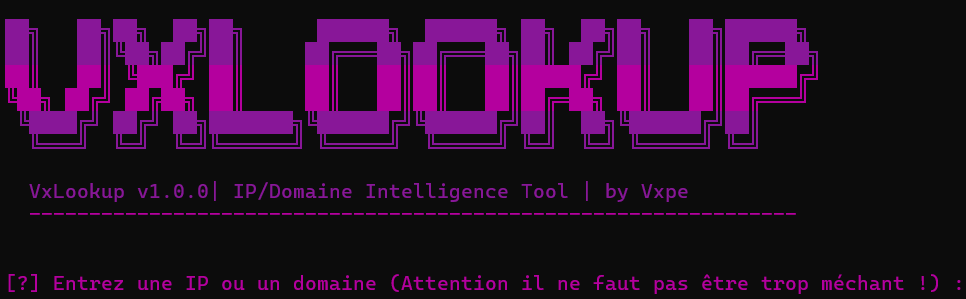

# 🔍 VxLookup - Ultimate IP/Domain Intelligence Tool




## 📌 Description
VxLookup est un outil avancé d'analyse réseau permettant d'obtenir des informations détaillées sur :
- 🗺️ Géolocalisation des adresses IP
- 🔓 Scan des ports ouverts
- 🌐 Recherche DNS complète
- 📊 Profilage des cibles réseau

Développé en Python avec une interface CLI colorée, cet outil est simple d'utilisation et éfficace pour des recherches poussées.

## ✨ Fonctionnalités
| Fonctionnalité          | Description                                                                 |
|-------------------------|-----------------------------------------------------------------------------|
| **Résolution DNS**      | Résolution multi-niveaux avec fallback sur DNS publics                      |
| **Scan de ports**       | Scan TCP ultra-rapide avec gestion intelligente des threads (50 max)        |
| **Géolocalisation**     | Interrogation de multiples sources (ip-api.com, ipapi.co)                   |
| **Recherche DNS**       | Support complet des records (A, AAAA, MX, NS, TXT, CNAME, SOA)             |
| **Export des résultats**| Sauvegarde au format JSON avec métadonnées complètes                        |

## 🛠️ Installation
### Prérequis
- Python 3.8+
- Pipenv (recommandé)

### Méthode : Installation directe
```bash
git clone https://github.com/SecureVxpe/VxLookup.git
cd VxLookup
pip install -r requirements.txt *(Image illustrative - remplacer par votre bannière)*
